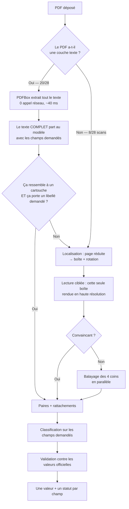

<div align="center">

# eDoc OCR — lecture automatique de cartouche

**Déposez un plan technique. Le formulaire se remplit tout seul.**

[](https://openjdk.org/projects/jdk/17/)
[](https://spring.io/projects/spring-boot)
[](https://pdfbox.apache.org/)
[](#-tests)
[](#-r%C3%A9sultats-mesur%C3%A9s)
[](#-o%C3%B9-vit-ce-code)

</div>

---

## Le problème

Chaque plan technique déposé dans **eDoc** (la GED de Bouygues Construction) oblige son auteur à
ressaisir à la main une dizaine de champs — numéro, phase, lot, émetteur, indice, niveau… — alors que
**tout est déjà imprimé sur le document**, dans un bloc appelé le **cartouche**.

Ce moteur lit ce cartouche et pré-remplit le formulaire. L'utilisateur **vérifie** au lieu de saisir.

<table>
<tr><th align="left">Ce que le PDF contient</th><th align="left">Ce que le moteur en fait</th></tr>
<tr valign="top"><td>

```
PROJET PHASE EMETTEUR LOT ZONE NIVEAU TYPE NUMERO INDICE
HUA    EXE   TRA      36  EXT  EX     PLA  3100   E
```

</td><td>

```json
{ "name": "spec_char2", "value": "EXE",
  "status": "AUTO_VALIDATED",
  "rawLabel": "PHASE", "matchScore": 100.0 }
```

</td></tr>
</table>

---

## Sommaire

- [Où vit ce code](#-o%C3%B9-vit-ce-code)
- [L'idée centrale](#-lid%C3%A9e-centrale)
- [Démarrage rapide](#-d%C3%A9marrage-rapide)
- [Comment ça marche](#%EF%B8%8F-comment-%C3%A7a-marche)
- [Les trois métiers](#-les-trois-m%C3%A9tiers-jamais-m%C3%A9lang%C3%A9s)
- [Le rattachement](#-le-rattachement--le-point-le-plus-d%C3%A9licat)
- [API](#-api)
- [Intégration dans eDoc](#-int%C3%A9gration-dans-edoc)
- [Structure du code](#%EF%B8%8F-structure-du-code)
- [Résultats mesurés](#-r%C3%A9sultats-mesur%C3%A9s)
- [Tests](#-tests)
- [Limites connues](#%EF%B8%8F-limites-connues)
- [Feuille de route](#%EF%B8%8F-feuille-de-route)
- [Reprendre le projet](#-reprendre-le-projet)

---

## 📍 Où vit ce code

Ce dépôt est le **moteur autonome** :

Le même code a depuis été **fusionné dans le back-end eDoc** (paquet `com.bycnit.socle.ocr`), où il
tourne dans le même processus que l'application — un seul service, un seul build. La logique de
lecture est identique ; seuls le paquet, la façon dont eDoc l'appelle et les versions de dépendances
alignées sur eDoc changent.

| | Ce dépôt (autonome) | Dans eDoc (fusionné) |
|---|---|---|
| Paquet | `com.bycn.edoc` | `com.bycnit.socle.ocr` |
| Appel | `POST /api/v1/extractions` (8081) | `ExtractionService.extract(...)` en mémoire |
| Spring Boot | 3.4.1 | 3.2.5 (parent eDoc) |
| Tests | 191 | 171 |

---

## 💡 L'idée centrale

> **On lit le texte que le PDF contient déjà. On ne « regarde » la page que s'il n'en a pas.**

Un plan produit par un logiciel de CAO **n'est pas une photo** : c'est un dessin vectoriel accompagné
de **son texte**, rangé dans le fichier, exact, avec sa mise en page. PDFBox l'extrait localement —
aucun appel réseau, quelques dizaines de millisecondes.

Sur le corpus de test, **20 documents sur 28** sont dans ce cas. Les 8 autres sont des **scans** : pour
eux seulement, il faut regarder l'image.

### À quoi sert le modèle, alors ?

À **une seule chose**, mais qu'aucune règle ne sait faire : **reconnaître lequel des blocs est le
cartouche**. Le texte extrait contient aussi les cotes, les altitudes, les légendes, l'annuaire des
intervenants — des centaines de lignes.

> [!IMPORTANT]
> **On ne lui dit jamais où regarder.** Lui désigner une zone créerait un point de défaillance
> unique : si la zone est fausse, tout est faux, et rien ne le signale. En lui donnant le texte
> complet, il voit le vrai cartouche **et** ses concurrents, et il tranche.

---

## 🚀 Démarrage rapide

### Prérequis

| Outil | Version |
|---|---|
| JDK | **17** |
| Maven | 3.9+ |

### Installation

```powershell
git clone https://github.com/flash-hero/PFA-BOUYGUES-.git
cd PFA-BOUYGUES-

./scripts/check_setup.ps1        # vérifie JDK, Maven, dépendances, clé API

Copy-Item .env.example .env      # puis renseigner OCR_API_KEY
```

### Configuration

Le fichier `.env`.

```dotenv
OCR_API_KEY=…
OCR_BASE_URL=https://<ressource>.services.ai.azure.com
OCR_FLAVOR=chat
OCR_MODEL=gpt-5.5
OCR_CHAT_PATH=/openai/v1/chat/completions
```

### Lancer

```powershell
mvn test              # 191 tests, aucun appel réseau, donc gratuits
mvn spring-boot:run   # le service autonome, port 8081
```

> [!NOTE]
> Ce port n'existe que pour le moteur **autonome**, c'est-à-dire ce dépôt. Dans eDoc, le moteur
> tourne dans le back-end : tout se passe sur le port 8080 et rien n'écoute sur 8081.

### Diagnostic

Le moteur journalise, pour chaque document, la voie empruntée :

```
Couche texte : 19481 caractères, 12 paires en 3776 ms
Aucune couche texte exploitable : lecture par l'image
```

Pour voir **exactement** les images envoyées au modèle — le réflexe à avoir **avant** de conclure
« le modèle n'a pas su lire » :

```powershell
mvn spring-boot:run "-Dspring-boot.run.jvmArguments=-Dedoc.debug-dump-dir=C:/tmp/crops"
```

---

## ⚙️ Comment ça marche



**La voie principale coûte un seul appel**, 2,4 à 3,8 s mesurés. La voie image en coûte deux, plus
6 à 7 s de CPU pour dessiner un A0 chargé — d'où l'écart de latence entre les deux.

---

## 🧩 Les trois métiers, jamais mélangés

| Étape | Ce qu'elle fait | Ce qu'elle ignore |
|---|---|---|
| **Extraction** | Trouve le cartouche, rend **toutes** ses paires libellé/valeur telles qu'imprimées | Quels champs existent dans eDoc |
| **Classification** | Range chaque paire sur un champ demandé | Si la valeur est correcte |
| **Validation** | Confronte la valeur aux valeurs officielles du projet | D'où vient la valeur |

**Pourquoi séparer ?** Chaque projet eDoc configure **sa propre** liste de champs, et les valeurs
officielles vivent dans Documentum. Le moteur ne connaît donc **aucun champ à l'avance** : ils lui
sont fournis dans l'appel. L'extraction, elle, reste identique pour tout le monde.

### Trois statuts par champ

| Statut | Signification | Effet dans le formulaire |
|---|---|---|
| `AUTO_VALIDATED` | Valeur lue **et** confirmée par la liste officielle | Rempli, vert |
| `TO_REVIEW` | Valeur lue, mais rien ne la confirme | Rempli, orange |
| `MISSING` | Rien de lisible | Laissé **vide** — jamais rempli au hasard |

> [!WARNING]
> **Règle D11 — non négociable.** Une valeur absente de la liste officielle n'est **jamais** rejetée
> ni effacée : elle passe en `TO_REVIEW`. Une liste officielle n'est jamais complète, et un chantier
> peut légitimement utiliser un code tout neuf.

---

## 🔗 Le rattachement : le point le plus délicat

Une fois le cartouche lu, il faut décider **quelle paire va dans quel champ**. C'est là que se jouent
la plupart des erreurs, parce qu'un cartouche imprime rarement le mot attendu tout seul :

| Ce qui est imprimé | Ce qu'eDoc demande | Ressemblance des chaînes |
|---|---|---|
| `NUMERO DE DOCUMENT` | Numéro | 50 / 100 |
| `Zone / Niveau` | Niveau | 63 / 100 |
| `Titre du Dessin` | Titre | 50 / 100 |

Le mot est là, mais noyé — et une comparaison de chaînes entières s'effondre sous le seuil de 80.

**Deux mécanismes combinés :**

1. **Le modèle propose le rattachement.** Il a le document sous les yeux et la liste des champs. Les
   noms qu'il peut citer sont **contraints par énumération** à la liste demandée — il ne peut pas en
   inventer un.
2. **La comparaison se fait aussi mot à mot**, en plus de la chaîne entière, et classée **juste en
   dessous** de celle-ci (sinon « Doc » vaudrait autant pour un champ « Doc » que pour « N° Doc », et
   l'ordre de la liste trancherait).

**Deux garde-fous — chacun vient d'un défaut réellement observé. Ne jamais les retirer :**

| Garde-fou | Ce qu'il empêche |
|---|---|
| **Anti-invention** | La valeur proposée doit exister **telle quelle** parmi les paires lues, sinon la proposition est jetée |
| **Anti-contresens** | Le libellé imprimé doit avoir un minimum de rapport avec le champ. Sans lui, le modèle a rangé `PROJET = "FUTUR PALAIS DE JUSTICE DE PARIS"` dans le champ **Phase** |

Un champ dont la proposition est refusée repasse par la comparaison floue. Une paire déjà prise n'est
plus offerte à un autre champ.

---

## 🔌 API

### `POST /api/v1/extractions`

Multipart : `file` (le document) + `request` (JSON).

<details>
<summary><b>Requête</b></summary>

```json
{
  "projectCode": "240716tdr",
  "fields": [
    { "name": "spec_char2",
      "labels": ["Phase", "Pha"],
      "allowedValues": [ {"code": "EXE", "libelle": "Exécution"},
                         {"code": "DOE", "libelle": "Dossier des ouvrages exécutés"} ] },
    { "name": "spec_char5",
      "labels": ["Bâtiment", "Bat"],
      "allowedValues": [] }
  ]
}
```

| Champ | Rôle |
|---|---|
| `name` | Le nom technique côté eDoc. Le moteur ne l'interprète **jamais**, il le renvoie tel quel |
| `labels` | Les libellés sous lesquels ce champ peut apparaître sur le papier |
| `allowedValues` | Les valeurs officielles. **Liste vide = champ libre** → `TO_REVIEW` |

</details>

<details>
<summary><b>Réponse</b></summary>

```json
{
  "cartoucheFound": true,
  "mode": "TEXT_LAYER",
  "corner": null,
  "qualityPassed": true,
  "durationMs": 4210,
  "fields": [
    { "name": "spec_char2", "value": "EXE", "status": "AUTO_VALIDATED",
      "rawLabel": "PHASE", "matchScore": 100.0, "referenceCode": "EXE" }
  ],
  "unclassifiedPairs": [ { "label": "ECHELLE", "value": "1/50" } ]
}
```

| Champ | À ne pas casser |
|---|---|
| `unclassifiedPairs` | Remonte **tout** ce qui a été lu sans champ correspondant — rien n'est perdu |
| `qualityPassed` | À `false`, signale une lecture douteuse : l'appelant **doit** le montrer à l'utilisateur |
| `mode` | Par quelle voie le document a été lu : `TEXT_LAYER`, `TWO_PASS_CROP`, `SINGLE_PAGE`, `NEEDS_TILING`. La première chose à regarder en diagnostic |

</details>

L'appel est protégé par l'en-tête `X-Api-Key`. Le traitement est **synchrone** : à 4,3 s de médiane,
un job asynchrone compliquerait l'appelant sans rien apporter.

> Dans la version fusionnée, ce même contrat n'est plus un appel HTTP mais un appel Java
> (`ExtractionService.extract(octets, requête)`) : **mêmes objets, mêmes règles, mêmes statuts**.
> C'est précisément parce que les champs et leurs valeurs autorisées voyagent **dans la demande** — et
> non dans un fichier de configuration du moteur — que le passage d'une forme à l'autre n'a rien coûté.

---

## 🔧 Intégration dans eDoc

```
Navigateur (Angular)
   │  l'utilisateur dépose un PDF dans « Nouveau document »
   ▼
POST /ocr/prefill                   ← eDoc back-end (port 8080)
   │  ajoute le code projet, va chercher les valeurs officielles dans Documentum,
   │  construit la liste des champs configurés pour CE projet
   ▼
ExtractionService.extract(...)      ← le moteur, en mémoire
   │  couche texte du PDF → modèle → paires + rattachements → validation
   ▼
le formulaire se remplit, chaque champ coloré selon son statut
```

**Pourquoi passer par le back-end plutôt que d'appeler le moteur depuis le navigateur ?** Pour que la
clé d'API reste **côté serveur**, et que l'appel soit protégé par la session eDoc existante.

### Ce qui a été ajouté côté eDoc

| Fichier | Rôle |
|---|---|
| `ocr/**` | **le moteur lui-même**, paquet `com.bycnit.socle.ocr` |
| `web/OcrController.java` | la porte d'entrée `POST /ocr/prefill` |
| `service/impl/OcrPrefillService.java` | construit la demande, appelle le moteur, traduit la réponse |
| `dto/Ocr{Prefill,Field,Pair}DTO.java` | les enveloppes de réponse |
| `_services/ocr.service.ts`, `model/ocr.model.ts` | l'appel côté navigateur |
| `new-document-sidebar.component.{ts,html}` | déclenche la lecture, remplit, colore les champs |

### Ajouter une valeur de référence depuis le formulaire

Une valeur lue au cartouche mais absente de la liste officielle obligeait l'utilisateur à **quitter
son dépôt** pour parcourir *Projet → Table de références → Plans → champ → ajouter*, puis à tout
recommencer.

Elle s'ajoute désormais **sur place**, depuis la liste déroulante. Et quand c'est le moteur qui l'a
proposée, elle porte un **drapeau jaune** — au survol : « cartouche lu nouvelle valeur a valider ».

### Trois règles de sécurité

- **Le pré-remplissage n'écrit rien.** Il ne fait que **lire** Documentum. La seule écriture du
  parcours est l'ajout de valeur ci-dessus : déclenchée explicitement, réservée aux rôles habilités,
  et passant par le service eDoc existant — aucune requête écrite à la main, aucun schéma touché.
- **Débrayable** (`ocr.enabled: false`) : le formulaire se comporte alors exactement comme avant.
- **Jamais bloquant.** Si le moteur est indisponible ou lent, l'utilisateur saisit à la main. Une
  panne de lecture ne doit jamais empêcher un dépôt.

### Le remplissage, côté formulaire

- Seuls les champs **encore vides** sont complétés — le pré-remplissage par nom de fichier existant
  s'exécute avant et **fait autorité**.
- Une valeur de liste déroulante n'est posée que si elle **existe vraiment** dans la liste du projet,
  sinon le champ paraîtrait rempli tout en étant vide.
- Une date lue au cartouche est **volontairement ignorée** : trop ambiguë pour être posée sans contrôle.

---

## 🏗️ Structure du code

```
src/main/java/com/bycn/edoc/
├── ocr/              trouver et lire le cartouche
├── classification/   ranger chaque paire sur le champ demandé
├── validation/       vérifier la valeur contre les valeurs officielles
├── api/              l'API REST appelée par eDoc
└── config/           lecture du fichier .env
```

Les fichiers qui comptent, dans `ocr/` :

| Fichier | Rôle |
|---|---|
| **`TwoPassCartoucheExtractor`** | **Le chef d'orchestre** — choisit la voie, contrôle le résultat, repart chercher si besoin. **À lire en premier** |
| `PdfTextLayer` | La voie principale : le texte déjà dans le PDF, mise en page conservée |
| `PdfSupport` | Dimensions de page et **rendu direct d'une région** (jamais la page entière qu'on découperait) |
| `CartoucheAnnotationSchema` | Les consignes de lecture — une version texte, une version image |
| `CartoucheLocationSchema` | La consigne « où est le cartouche ? » (rectangle + rotation) |
| `OcrClient` | Les appels HTTP : nouvelles tentatives, cache, consensus |
| `CartouchePlausibility` / `CartoucheScore` | Les garde-fous « est-ce bien un cartouche ? » |

Dans `api/`, **`ExtractionService`** enchaîne les trois métiers et applique les deux garde-fous du
rattachement.

> [!IMPORTANT]
> **Règle d'architecture :** le cœur ne manipule que des **`byte[]`**, jamais un chemin de fichier. En
> production les octets viennent d'un upload — la logique de lecture ne doit pas savoir d'où ils
> viennent. C'est ce qui a permis de fusionner le moteur dans eDoc sans réécrire une ligne
> d'extraction.

---

## 📊 Résultats mesurés

Le corpus mélange plusieurs familles de projets : un plan « Palais de Justice » n'a légitimement ni
Phase, ni Lot, ni Zone. **Compter les champs remplis en moyenne n'a donc aucun sens.** La mesure
utilisée est celle du vrai défaut :

> un champ laissé **vide** alors qu'une paire lue porte **son libellé** est un **raté de rattachement**.

Elle se calcule automatiquement, **sans vérité terrain** — l'information est dans la réponse elle-même.

| Mesure (28 documents, cache vidé) | Valeur |
|---|---|
| Cartouche trouvé et lu | **28 / 28** |
| **Ratés de rattachement** | **0** (sur cinq passages complets) |
| Latence médiane | **4,3 s** (contre 9,6 s par l'image) |
| Documents au-dessus de 20 s | 1 (un scan A0 très dense) |
| Lus par la couche texte | 20 / 28 |
| Vérifiés à l'œil (1, 4, 11, 12, 13, 16) | tous les champs exacts |

### Leviers testés puis rejetés par la mesure

<details>
<summary>À lire avant de proposer une « amélioration »</summary>

| Levier | Pourquoi il a été rejeté |
|---|---|
| Baisser la résolution de lecture (3400 → 2400 px) | `13.pdf` refusionne deux cellules (`EMETTEUR = "IDFC 25"`) et décale toute la ligne. **La résolution de lecture n'est pas un levier de latence** : c'est elle qui sépare les cellules d'un tableau serré |
| Rendu gris / qualité écran pour la lecture | `16.pdf` passe de 13 à 29 paires en faisant remonter un tableau de révisions. Conservé pour la **localisation**, qui ne lit aucun texte |
| Élargir la zone découpée | L'appariement libellé/valeur s'effondre et de longues valeurs sont tronquées |
| Détecter l'orientation via la couche texte | Le seul document au cartouche couché est justement celui qui n'a **aucun glyphe** |
| Donner en indice une liste de champs attendus | Suppression reproductible de champs réels absents de la liste d'indices |

</details>

---

## 🧪 Tests

```powershell
mvn test
```

**191 tests, tous verts, aucun appel réseau** — donc gratuits et instantanés. `MockRestServiceServer`
simule le modèle : on vérifie ce qui est *envoyé* sans rien payer.

Protocole obligatoire pour tout changement touchant l'extraction :

1. Cache **vidé** — sinon on mesure le cache.
2. **Corpus complet.** Un panel de 7 documents n'a historiquement rien vu de régressions massives.
3. Comparer le **contenu** des paires, pas leur nombre (« plus de paires » a déjà signifié « pire »).
4. Une seule variable à la fois.
5. Jamais de conclusion sur un seul passage : la latence varie du simple au double.

---

## ⚠️ Limites connues

1. **Les scans restent lents.** Sans texte dans le fichier, il faut dessiner le PDF (6 à 7 s de CPU
   sur un A0 chargé) puis faire deux appels. Un document dépasse encore 20 s.
2. **Le temps de réponse du service varie du simple au double.** Le même document peut mettre 20 s
   puis 31 s. Ne jamais conclure d'un seul essai.
3. **Deux lectures identiques ne donnent pas toujours le même résultat.** Le modèle accepte
   `temperature=0` et `seed`, mais le fournisseur ne garantit rien. Le mécanisme de vote
   (`ocr.samples`) existe et est prêt ; il est réglé à 1 **par coût**, pas par confiance.
4. **Les deux seuils de correspondance floue (80 et 85) sont choisis au jugé.** Les calibrer demande
   une vérité terrain, qui n'existe pas encore. **Ne pas les bouger au hasard pour corriger un cas
   particulier** : ça déplacerait le problème ailleurs sans qu'on le sache.
5. **Une couche texte présente n'est pas forcément fiable** (texte invisible, calques). Le contrôle
   qui déclenche le repli image est volontairement simple : forme de cartouche **et** au moins un
   libellé demandé.

---

## 🤝 Reprendre le projet

- **Le modèle est toujours épinglé** (`gpt-5.5`), jamais un alias glissant : les mesures doivent
  rester comparables d'un jour à l'autre.
- **Ne jamais commiter** `.env` (il contient la clé d'API).
- **Tout changement touchant l'extraction se mesure, jamais ne se suppose** : une variable à la fois,
  cache vidé, sur le corpus complet.
- **Une contrainte mesurée sur un outil ne survit pas au changement d'outil.** La règle « il faut
  découper l'image, sinon le modèle ne lit rien » venait d'un modèle précédent ; reconduite sans être
  remesurée, elle a orienté l'architecture à tort pendant deux sessions — jusqu'à ce qu'on découvre
  que 20 documents sur 28 portaient leur cartouche en texte clair dans le fichier.

> **Avant d'optimiser la façon de regarder une image, vérifier qu'il faut regarder.**

### Ce qui n'est pas dans ce dépôt

Le corpus de test (des plans internes, donc jamais versionnés) et les outils de diagnostic sont dans
`unecessiry/`. La documentation longue en français est dans `read/1/` : `understand.md` (tout le
projet expliqué simplement), `howtorun.md`, `instruction.md`, `plan_travail_ocr_edoc.md` et
`AGENT_CONTEXT.md` (la référence technique dense).

---

<div align="center">

**Bouygues Construction IT Maroc**
Oussama Tabakh

</div>
